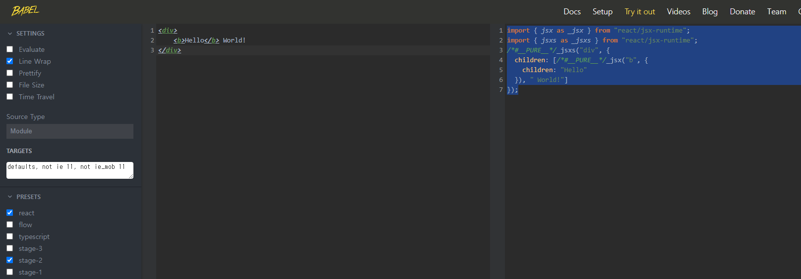

# JSX 기본 규칙 알아보기

JSX 는 리액트에서 생김새를 정의할 때, 사용하는 문법이다. 얼핏보면 HTML 같이 생겼지만 실제로는 JavaScript 이다.

```javascript
return <div>안녕하세요</div>;
```

리액트 컴포넌트 파일에서 XML 형태로 코드를 작성하면 babel 이 JSX 를 JavaScript 로 변환 해준다.

[BABEL Try it out]("https://babeljs.io/repl")

```javascript
<div>
  <b>Hello</b> World!
</div>
```



Babel 은 자바스크립트의 문법을 확장해주는 도구이다. 아직 지원되지 않는 최신 문법이나, 편의상 사용하거나 실험적인 자바스크립트 문법들을 정식 자바스크립트 형태로 변환해줌으로서 구형 브라우저 같은 환경에서도 제대로 실행 할 수 있게 해주는 역할을 한다.

JSX 가 JavaScript 로 제대로 변환이 되려면 지켜주어야 하는 몇가지 규칙이 있다.

## 꼭 닫혀야 하는 태그

태그는 꼭 닫혀 있어야 한다.

다음과 같은 코드는 오류가 발생함.

### App.js

```javascript
import React from 'react';
import Hello from './Hello';

function App() {
  return (
    <div>
      <Hello />
      <Hello />
      <Hello />
      <div> {/* 태그를 열었으면 꼭 <div></div> 이렇게 닫아야 함! */}
    </div>
  );
}

export default App;
```

HTML 에서는 `input` 또는 `br` 태그를 사용 할 때 닫지 않고 사용하기도 한다. 하지만 리액트에서는 그렇게 하면 안된다.

### App.js

```javascript
import React from 'react';
import Hello from './Hello';

function App() {
  return (
    <div>
      <Hello />
      <Hello />
      <Hello />
      <input> {/* Self Closing 태그 사용! <input /> */}
      <br> {/* Self Closing 태그 사용! <br /> */}
    </div>
  );
}

export default App;
```

## 꼭 감싸져야하는 태그

두개 이상의 태그는 무조건 하나의 태그로 감싸져 있어야 한다.

### App.js

```javascript
import React from 'react';
import Hello from './Hello';

function App() {
  return (
    <Hello />
    <div>안녕히계세요.</div>
  );

/* 아래와 같이 하나의 태그로 감싸주어야 한다!
function App() {
  return (
    <div>
        <Hello />
        <div>안녕히계세요.</div>
    </div>
  );
*/
}

export default App;
```

단순히 감싸기 위해 불필요한 div 로 감싸는게 별로 좋지 않은 상황도 있다.

- 스타일 관련 설정을 하다 복잡해 지는 경우
- table 관련 태그를 작성하는 경우

> 리액트의 Fragment 를 사용하면 된다.

### App.js

```javascript
import React from "react";
import Hello from "./Hello";

function App() {
  return (
    <>
      <Hello />
      <div>안녕히계세요</div>
    </>
  );
}

export default App;
```

## JSX 안에 자바스크립트 값 사용하기

JSX 내부에 자바스크립트 변수를 보여줘야 할 때는 `{}` 으로 감싸서 보여준다.

```javascript
import React from "react";
import Hello from "./Hello";

function App() {
  const name = "react";
  return (
    <>
      <Hello />
      <div>{name}</div>
    </>
  );
}

export default App;
```

## style 과 className

JSX 에서 태그에 `style` 과 CSS Class 를 설정하는 방법은 HTML 에서 설정하는 방법과 다르다.

우선, 인라인 스타일은 객체 형태로 작성해야 하며, `background-color` cjfja `-` 로 구분되어 있는 이름들은 `backgroundColor` 처럼 camelCase 형태로 네이밍 해주어야 한다.

### App.js

```javascript
import React from "react";
import Hello from "./Hello";

function App() {
  const name = "react";
  const style = {
    backgroundColor: "black",
    color: "aqua",
    fontSize: 24, // 기본 단위 px
    padding: "1rem", // 다른 단위 사용 시 문자열로 설정
  };

  return (
    <>
      <Hello />
      <div style={style}>{name}</div>
    </>
  );
}

export default App;
```

그리고 CSS Class 를 설정 할 때에는 `class=` 가 아닌 `className=` 으로 설정해야 한다.

### App.css

```css
.gray-box {
  background: gray;
  width: 64px;
  height: 64px;
}
```

### App.js

```javascript
import React from "react";
import Hello from "./Hello";
import "./App.css";

function App() {
  const name = "react";
  const style = {
    backgroundColor: "black",
    color: "aqua",
    fontSize: 24, // 기본 단위 px
    padding: "1rem", // 다른 단위 사용 시 문자열로 설정
  };

  return (
    <>
      <Hello />
      <div style={style}>{name}</div>
      <div className="gray-box"></div>
    </>
  );
}

export default App;
```

## 주석

JSX 내부의 주석은 `{/* 이런 형태로 */}` 작성한다.

### App.js

```javascript
import React from "react";
import Hello from "./Hello";
import "./App.css";

function App() {
  const name = "react";
  const style = {
    backgroundColor: "black",
    color: "aqua",
    fontSize: 24, // 기본 단위 px
    padding: "1rem", // 다른 단위 사용 시 문자열로 설정
  };

  return (
    <>
      {/* 주석은 화면에 보이지 않습니다 */}
      /* 중괄호로 감싸지 않으면 화면에 보입니다 */
      <Hello />
      <div style={style}>{name}</div>
      <div className="gray-box"></div>
    </>
  );
}

export default App;
```

추가적으로, 열리는 태그 내부에서는 `// 이런 형태로도` 주석이 가능하다.

```javascript
import React from "react";
import Hello from "./Hello";
import "./App.css";

function App() {
  const name = "react";
  const style = {
    backgroundColor: "black",
    color: "aqua",
    fontSize: 24, // 기본 단위 px
    padding: "1rem", // 다른 단위 사용 시 문자열로 설정
  };

  return (
    <>
      {/* 주석은 화면에 보이지 않습니다 */}
      /* 중괄호로 감싸지 않으면 화면에 보입니다 */
      <Hello
      // 열리는 태그 내부에서는 이렇게 주석을 작성 할 수 있습니다.
      />
      <div style={style}>{name}</div>
      <div className="gray-box"></div>
    </>
  );
}

export default App;
```
